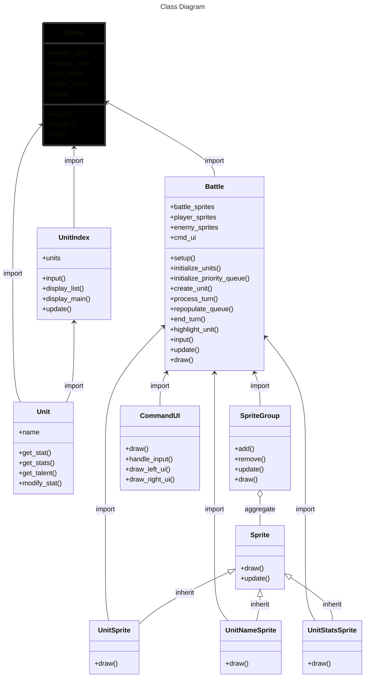

```mermaid
---
title: Class Diagram
config:
    class:
    hideEmptyMemmbersBox: true
---
classDiagram
    class Game:::main {
        +player_units
        +enemy_units
        +unit_index
        +index_open
        +battle
        +input()
        +render()
        +run()
    }
    class UnitIndex {
        +units
        +input()
        +display_list()
        +display_main()
        +update()
    }
    class Unit {
        +name
        +get_stat()
        +get_stats()
        +get_talent()
        +modify_stat()
    }
    class Battle {
        +battle_sprites
        +player_sprites
        +enemy_sprites
        +cmd_ui
        +setup()
        +initialize_units()
        +initialize_priority_queue()
        +create_unit()
        +process_turn()
        +repopulate_queue()
        +end_turn()
        +highlight_unit()
        +input()
        +update()
        +draw()
    }
    class Sprite {
        +draw()
        +update()
    }
    class SpriteGroup {
        +add()
        +remove()
        +update()
        +draw()
    }
    class UnitSprite {
        +draw()
    }
    class UnitNameSprite {
        +draw()
    }
    class UnitStatsSprite {
        +draw()
    }
    class CommandUI {
        +draw()
        +handle_input()
        +draw_left_ui()
        +draw_right_ui()
    }

    Game <-- Unit : import
    Game <-- UnitIndex : import
    Game <-- Battle : import
    UnitIndex <-- Unit : import
    Battle <-- CommandUI : import
    Battle <-- SpriteGroup : import
    Battle <-- UnitSprite : import
    Battle <-- UnitNameSprite : import
    Battle <-- UnitStatsSprite : import
    Sprite <|-- UnitSprite : inherit
    Sprite <|-- UnitNameSprite : inherit
    Sprite <|-- UnitStatsSprite : inherit
    SpriteGroup o-- Sprite : aggregate

classDef main fill:#000,stroke:#333,stroke-width:4px;
```
